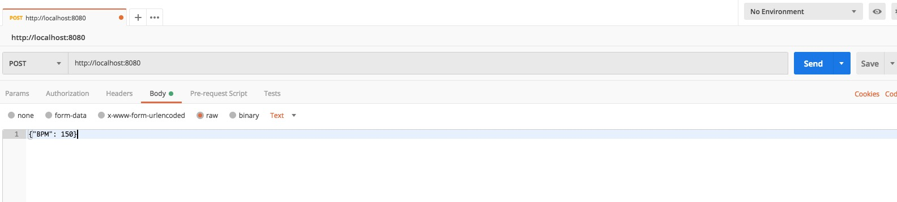

## Summary

Go server that creates and adds to a Blockchain. And you can see in browser :)

## Setup

Run `make build` to see what you need to do. Then again, I committed package things
because I can do whatever I want!  My repo!

You'll want to declare the `GOPATH` as your working directory.
Then, run the following. If it doesn't work, uhh, RIP.

```
go get github.com/davecgh/go-spew/spew
go get github.com/gorilla/mux
go get github.com/joho/godotenv
```

## Running

Run `make` or `make go`.  Should start up a server at `http://localhost:8080/`.

To add to the Blockchain, do a POST request via Postman or curl. You can try out
`make post` to see a curl call.

But Postman uses antimatter, so it's cooler to use.



## Reference

[Code your own blockchain in less than 200 lines of Go!](https://medium.com/@mycoralhealth/code-your-own-blockchain-in-less-than-200-lines-of-go-e296282bcffc)
